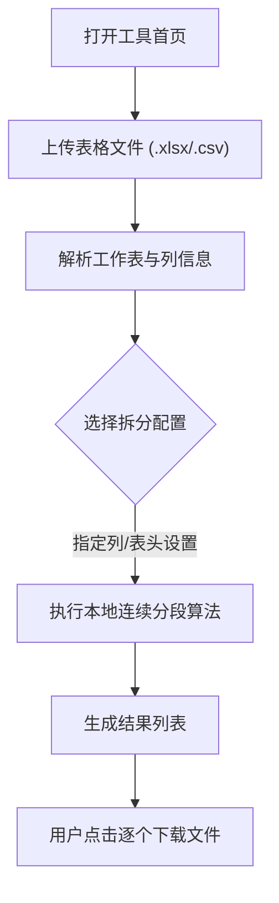

## 1. 产品概述
这是一款纯 Web 端运行的 Excel 拆分工具，无后端、纯本地解析，确保用户数据隐私。
- 主要用于帮助用户根据“某一列的连续相同内容”快速将大型表格拆分为多个独立的表格文件。
- 采用极具科技感与精密感的 Linear 设计系统，完美支持亮/暗模式智能切换。

## 2. 核心功能

### 2.1 核心模块
1. **文件上传区**：支持拖拽、点击上传 `.xlsx`、`.csv` 或 `.xls` 文件。
2. **拆分配置区**：选择工作表、选择拆分列、选择是否保留第一行为表头。
3. **拆分结果预览**：展示拆分后的段落名称与包含行数。
4. **批量导出**：提供逐个文件下载的功能，完美保留原 `.xlsx` 文件的单元格样式（字体、颜色、边框）。

### 2.2 页面详情
| 页面名称 | 模块名称 | 功能描述 |
|-----------|-------------|---------------------|
| 首页 | 上传模块 | 虚线框区域，支持拖拽文件或点击选择文件。 |
| 首页 | 配置模块 | 读取表头并提供下拉框选择：目标工作表、目标拆分列，以及勾选“第一行为表头”。 |
| 首页 | 预览与下载区 | 列表形式展示每个拆分出来的段落，点击行尾图标可直接下载单份文件。 |

## 3. 核心流程
用户打开工具 -> 拖入 Excel 文件 -> 工具本地解析并展示工作表及列信息 -> 用户选择“A列”作为拆分依据并点击拆分 -> 工具根据A列内容连续变化作为分段点在内存中生成多个工作簿 -> 用户在结果列表中逐个点击下载。

## 4. UI/UX 设计规范
### 4.1 设计风格
- 深度对齐 Linear 设计规范。
- **色彩系统**：
  - 深色模式：背景 `#08090a`，面板 `#0f1011`。
  - 浅色模式：背景 `#f7f8f8`，面板 `#ffffff`。
  - 强调色：靛蓝色 `#5e6ad2` 用于核心操作按钮。
- **边框与阴影**：摒弃实色边框，采用超细半透明白色边框 `rgba(255,255,255,0.05)`，阴影极其克制。
- **字体系统**：全局使用 `Inter Variable`（开启 `cv01`, `ss03`），大标题使用 `-1.056px` 负字间距，关键文本使用 `510` 字重。

### 4.2 页面设计概览
| 页面名称 | 模块名称 | UI 元素 |
|-----------|-------------|-------------|
| 首页 | 全局布局 | 居中的卡片式布局，平滑的 Framer Motion 过渡动画，顶部支持主题切换按钮。 |
| 首页 | 上传区 | 虚线边框，悬浮时边框高亮，支持拖拽反馈。 |
| 首页 | 结果列表 | 极低透明度的背景悬浮高亮，带有精致的下载 Icon 按钮。 |

### 4.3 响应式
- 桌面优先设计，保持宽屏下的信息密度。
- 移动端自适应，卡片宽度收缩，操作区适配触控点击。