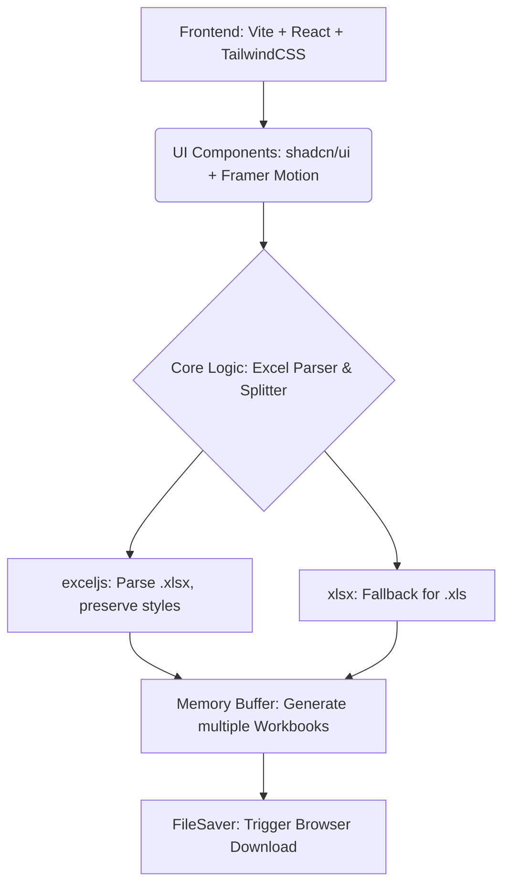

## 1. 架构设计

## 2. 技术栈说明
- **前端框架**: React@18 + Vite
- **UI & 样式**: Tailwind CSS@3 + framer-motion (Linear 设计规范实现)
- **UI 组件库**: shadcn/ui, radix-ui
- **核心数据处理**:
  - `exceljs`: 完美支持读取与写入 `.xlsx`，支持单元格样式、合并、行高列宽等信息的完整保留。对于 CSV 也能完美处理内部逗号转义问题。
  - `xlsx` (SheetJS): 作为 `.xls` 等老旧格式的回退支持（纯数据解析，不保留样式）。
  - `file-saver`: 处理浏览器端的 Blob 文件下载。

## 3. 核心算法设计
### 3.1 连续分段拆分算法 (Continuous Splitting)
1. **数据解析**: 用户选择文件后，通过 FileReader 读取 ArrayBuffer 并交给 `exceljs.Workbook.xlsx.load`。
2. **提取表头**: 默认从第一行提取所有列的样式和值，缓存为 `headerRow`。
3. **逐行遍历**:
   - 用户指定“拆分依据列”（如 A 列），遍历第 2 行至末尾。
   - 读取当前行 A 列的 `value`，遇到合并单元格则继承主单元格的 `value`。
   - 若当前行 `value` 与上一行不同，则认定为新的分段边界，在内存中新建一个 Workbook 实例。
4. **生成段落**:
   - 新 Workbook 中克隆 `headerRow`（包括所有样式）。
   - 将该分段范围内的所有原始行（`row` 对象）克隆至新 Workbook 中。
5. **下载触发**:
   - 拆分完毕后，生成带有各个 Workbook 对象的结果列表。
   - 用户点击下载时，调用 `workbook.xlsx.writeBuffer()` 生成二进制流，并通过 `URL.createObjectURL` 触发下载。

## 4. 主题与样式实现
- **CSS 变量**: 定义于 `index.css`，配置 `shadcn/ui` 所需的颜色 Tokens（`--background`, `--foreground`, `--primary` 等）。
- **Linear 风格**: 
  - 通过 `font-feature-settings: "cv01", "ss03"` 调整 Inter 字体。
  - 通过 `border-white/5` 搭配极弱的 `box-shadow` 实现卡片和输入框的深度感。
  - 暗色模式背景锁定为 `#08090a`，浅色模式为 `#f7f8f8`。
- **状态管理**: 采用轻量级 Context 或 Zustand 管理当前上传文件状态与拆分进度。