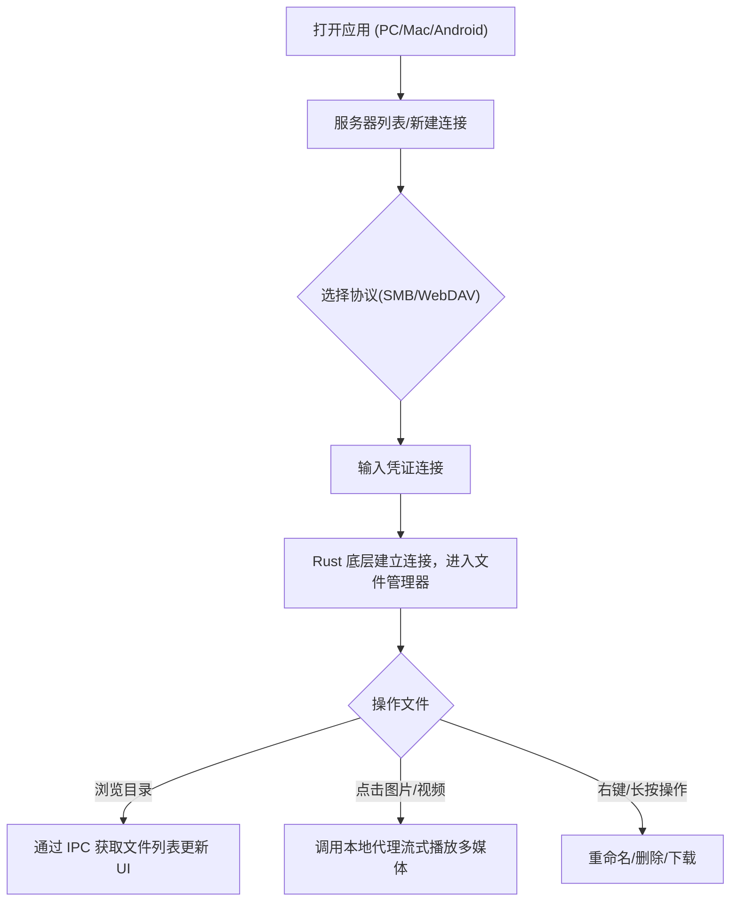

## 1. 产品概述
基于 Tauri 2.0 的跨平台 NAS 文件管理器客户端。
采用 Web 技术栈开发前端界面，借助 Rust 底层能力完美打破浏览器沙盒限制，实现纯本地运行、无需额外部署后端代理。
支持 SMB 和 WebDAV 协议连接 NAS 设备，提供类似现代操作系统（如 macOS Finder）的直观操作界面，并内置多媒体播放能力。
本产品将在视觉体验上全面对标 Linear 的顶级设计系统，打造极具科技感、精密感和极简主义的现代桌面应用，并**全面支持亮/暗模式的智能切换**。

## 2. 核心功能

### 2.1 核心模块
1. **连接管理模块**：支持添加、编辑、删除和快速连接 SMB 或 WebDAV 服务器。凭证安全存储在本地系统中。
2. **文件管理器模块**：提供文件/文件夹浏览、排序、搜索、重命名、删除、新建等功能，支持多视图切换（列表/网格）。默认按时间倒序（新内容优先）；排序支持名称/时间/大小；搜索支持实时过滤。
3. **多媒体预览模块**：内置图片查看器和视频播放器，通过 Tauri 的流式传输能力直接在前端预览 NAS 上的大体积媒体文件。
4. **外观设置模块**：支持主题模式切换（浅色/深色/跟随系统），并实时平滑过渡。

### 2.2 页面详情
| 页面名称 | 模块名称 | 功能描述 |
|-----------|-------------|---------------------|
| 连接页 | 服务器列表 | 展示已保存的服务器列表，支持点击一键连接。 |
| 连接页 | 新建连接表单 | 输入协议（SMB/WebDAV）、地址、端口、账号、密码进行连接。 |
| 文件管理页 | 顶部导航栏 | 面包屑导航、搜索框、视图切换、排序方式选择、主题切换按钮。 |
| 文件管理页 | 文件列表区 | 展示当前目录内容，支持右键菜单/长按菜单（下载、删除、重命名）。 |
| 多媒体预览 | 图片浏览器 | 支持图片的放大、缩小、上一张/下一张切换。 |
| 多媒体预览 | 视频播放器 | 基于浏览器原生播放器，支持常见 Web 视频格式（MP4/WebM）的流式播放和进度条拖拽。 |

## 3. 核心流程
用户打开 App -> 选择或新建 NAS 连接 -> Tauri (Rust) 底层建立网络连接 -> 进入文件管理器界面 -> 浏览目录与文件 -> 点击多媒体文件触发 Rust 端的数据流转发至前端播放器预览 -> 点击其他文件触发下载到本地设备。

## 4. UI/UX 设计规范 (深度融入 Linear 设计系统)
本应用将彻底摒弃传统的后台管理面板风格，严格遵循 **Linear Design System** 的核心理念，打造极具“精密工程感”的原生体验，并在亮/暗模式下保持高度一致的美学标准。

### 4.1 视觉主题与自适应色彩系统 (Adaptive Color System)
- **智能模式切换**：支持“浅色 (Light)”、“深色 (Dark)”以及“跟随系统 (System)”三种模式。
- **深色模式 (Dark Mode)**：
  - 画布：极深色基底（背景 `#08090a`，面板 `#0f1011`）。
  - 边框与深度：不使用实色边框，采用超细的半透明白色边框（`rgba(255,255,255,0.05)` 到 `0.08`）。深度通过背景亮度的极微小提升来体现。
  - 文本：柔和的近白色 `#f7f8f8`。
- **浅色模式 (Light Mode)**：
  - 画布：极简干净的浅色基底（背景 `#f7f8f8`，面板 `#ffffff`，次级表面 `#f3f4f5`）。
  - 边框与深度：采用极浅的灰色边框（`#e6e6e6` 或 `#d0d6e0`），结合极其克制的微小灰色阴影（如 `rgba(0,0,0,0.03)`）来体现悬浮感。
  - 文本：深灰色到近黑色。
- **克制的强调色**：无论亮暗模式，全应用仅在核心操作按钮（Primary CTA）、活动状态使用 Linear 标志性的靛蓝色（Indigo `#5e6ad2` / `#7170ff`），其余保持无彩色的高级灰阶。

### 4.2 极密的排版系统 (Typography)
- **字体族**：全局使用 `Inter Variable`，并**强制开启 OpenType 特性 `"cv01", "ss03"`**，使其呈现出更干净、更几何化的科技感。代码或路径等技术信息使用等宽字体（如 `Berkeley Mono` 或 `SF Mono`）。
- **特有的字重**：大量使用 `510` 字重（介于 Regular 和 Medium 之间）作为界面文本的标准强调色，显得精致而不笨重。
- **负字间距 (Tracking)**：对于大标题（如 48px 以上），采用激进的负字间距（如 `-1.056px`），营造紧凑、权威的视觉张力。

### 4.3 组件生态 (Shadcn/UI + Linear 定制)
我们将基于 `shadcn/ui` 组件，利用 CSS 变量（CSS Variables）构建一套响应主题切换的设计令牌（Design Tokens）：
- **Context Menu (右键菜单) & Command Palette (全局搜索)**：拥有极细的边框、8px-12px 的平滑圆角、以及随主题切换的多层阴影叠加。
- **List / Grid 视图**：文件列表的高亮状态采用极低透明度的背景和圆角，配合平滑的过渡动画（Framer Motion），避免生硬的颜色切换。

### 4.4 响应式策略
- **桌面端 (PC/Mac)**：宽屏下的多栏布局，支持侧边栏折叠。
- **移动端 (Android)**：自动切换为底部导航栏或抽屉式菜单，列表布局适应窄屏，使用长按手势替代右键菜单，支持多点触控的图片缩放。
